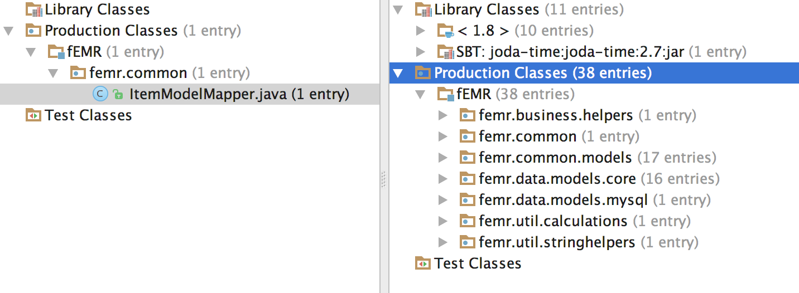
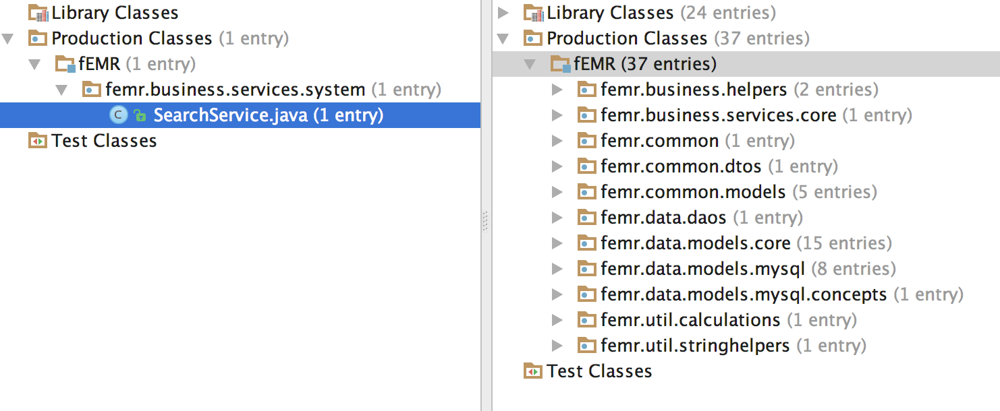
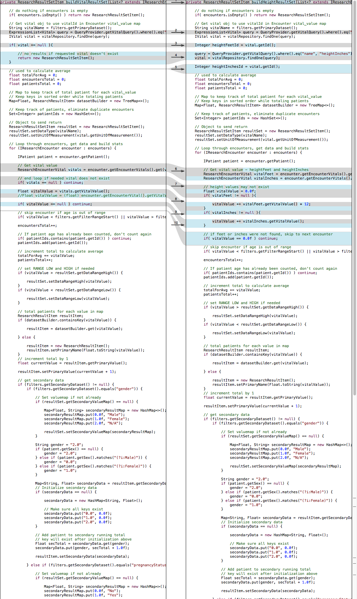
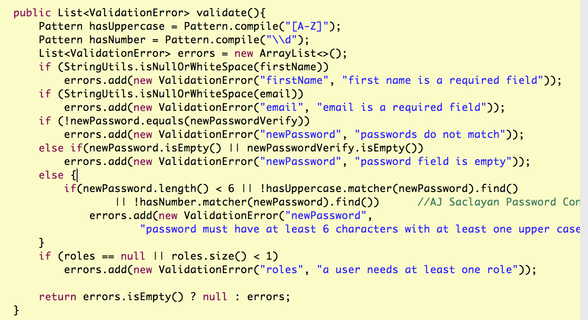

## Cohesion

There is only one cohesion metric, `LCOM5`, shown in the report.

LCOM5 metric indicates the number of functionalities of the class. It is calculated by taking a non-directed graph, where the nodes are the implemented local methods of the class and there is an edge between the two nodes if and only if a common (local or inherited) attribute or abstract method is used or a method invokes another. The value of the metric is the number of connected components in the graph not counting those, which contain only constructors, destructors, getters, or setters.

Thus, class with the high value of LCOM5 metric would have low cohesion and vice versa.

### Low Cohesion

According to the metric and our analysis, we got the two class with lowest cohesion (highest value of LCOM5 meanwhile) are:

#### `ItemModelMapper.java` (LCOM5: 16)

This class doesn’t have any attribute, and has 18 methods. Among the 18 methods, there are only two pairs of methods have invocation relationship. So the LCOM5 value of this class is calculated as 16 [`18 + (1 - 2) + (1 - 2)`], same as the result of SourceMeter.

This class's cohesion is __logical cohesion__. This class performs a series of creation actions. While all creation methods create different type of object. They only map the parameters values onto the new-created object.

#### `StringUtils.java` (LCOM5: 9)

This class doesn’t have any attribute, and has 12 methods. Among the 12 methods, there is one method invoked by another three methods. The rest of methods don't have relationship to each other. So the LCOM5 value of this class is calculated as 9 [`12 + (1 - 4)`], same as the result of SourceMeter.

This class's cohesion is __coincidental cohesion__. Although methods of this class are all about Strings, they are unrelated. Some methods format other type to String, while some methods just combine several Strings with a format, and some methods validate the input String and return Bool value.

### High Cohesion

By same rationale, we started searching for the highest cohesion by ascending order of these classes’ LCOM5 value. And then we noticed that there are many classes whose LCOM5 is 0 because they have only setter, getters, etc. So we skipped them as well as other trivial classes who have only one method inside.

Also, we skipped some exceptions during the mountain climb. For example, we skipped TriageController.java since we noticed that there are two records (TriageController and TriageControlle$1) pointing to the same class TriageController.java while these two records are having different stats on it. Another case is the AllowedRolesAction.java class. The LCOM5 given is 1 while we got 2 after the analysis thus we skipped it.
After the filter, we got the highest two: `TabController.java` and `UsersController.java`.

#### `TabController.java` (LCOM5: 1)

This class has 4 attributes, and 4 methods. All the 4 methods share the attribute `tabService`, which means LCOM5 value of this class is 1.

This class's cohesion is __information cohesion__. This class performs four actions, each of which has its own entry point and independent code. While all actions shared `sessionService` and `tabService`. The two shared attributes are shared data. Essentially, this is an abstract data type.

#### `UsersController.java` (LCOM5: 1)

This class has 6 attributes, and 7 methods. All the 7 methods are connected because they share the attributes.

The class's cohesion is __information cohesion__. This class performs six actions, each of which has its own entry point and independent code. While all actions are related to users' information, they share `missionTripService` .`sessionService`, `userService` and `roleService`.

### DIFF

In the case of our analysis, high-cohesion classes have attributes. And actions in the class share attributes. Attributes are shared data.

While low-cohesion classes don't have attributes, their actions are neither sharing data, nor invoking each other a lot. Because those low-cohesion classes' actions are either functional unrelated or not associated.

## Coupling

We picked metric `CBO` to analysis coupling.

CBO stands for Coupling Between Object classes. It indicates number of directly used other classes (e.g. by inheritance, function call, type reference, attribute reference). Classes using many other classes highly depend on their environment, so it is difficult to test or reuse them; furthermore, they are very sensitive to the changes in the system.

Thus, class with the high value of CBO metric would have high coupling and vice versa.

### High Coupling

#### `ItemModelMapper.java` (CBO: 38)

We used the dependencies analysis tool of IDE, having the result:

This class depends on 38 internal classes, which means it's CBO value is 38, same as the result of SourceMeter.

Among the 38 depended classes, 35 of them are model class. `ItemModelMapper` only call their constructors and getter/setters. We think the coupling between `ItemModelMapper` and those model class is __data coupling__ as only required data is passed.

The rest depended classes are utility classes. `ItemModelMapper` passes an argument and explicitly controlled by returned value. These coupling is __control coupling__.

#### `SearchService.java` (CBO: 35)

We used the dependencies analysis tool of IDE, having the result:

This class depends on 37 internal classes, which means it's CBO value is 37, while CBO result of SourceMeter is 35.

Among the 37 depended classes, most are model classes, and `SearchService` class directly references the content of those model classes. These coupling is __content coupling__.

There are also coupling to utility classes. `ItemModelMapper` passes an argument and explicitly controlled by returned value. These coupling is __control coupling__.

### Low Coupling

#### `GsonFlattener.java` (CBO: 0)

We used the dependencies analysis tool of IDE, having the result:

This class depends on none of internal class, which means it's CBO value is 0, same as the result of SourceMeter.

For those which is coupled with `GsonFlattener`, the coupling should be __data coupling__, only required data is passed into this class.

#### `FEMRAuthenticated.java` (CBO: 0)

We used the dependencies analysis tool of IDE, having the result:

This class depends on 2 internal classes, which means it's CBO value is 2, while CBO result of SourceMeter is 0.

For those which is coupled with `GsonFlattener`, the coupling should be __control coupling__, this class explicitly controls the logic of others.

### DIFF

In the case of our analysis, high-coupling classes have more complex code. They are kind of middleware between models and other classes. They are coupled a lot with model classes, so that other classes don't have to be coupled with model classes.

While low-coupling classes have less complex code. Their responsibilities are clear and simple. For example `GsonFlattener` is only responded to map JSONObject to Map/List. And `FEMRAuthenticated` is only about authentication.

## Bad Smell

### Internal Duplicate

#### `ResearchService.java`

This class is flagged with internal duplicate smell because these 3 methods have duplication code with each other:

- `buildVitalResultSet(List encounters, ResearchFilterItem filters): ResearchResultSetItem`
- `buildHeightResultSet(List encounters, ResearchFilterItem filters): ResearchResultSetItem`
- `buildAgeResultSet(List encounters, ResearchFilterItem filters): ResearchResultSetItem`

For example, the following picture picts the diff between the first and second method. According to which we can see there are several snippets of code are duplicated.

I agree that this detected smell is an actual smell. The duplicated code can be merged to another methods and place calls for the new method in both places. Merging duplicate code simplifies the structure of your code and makes it shorter.

#### `SearchService.java`

This class is flagged with internal duplicate smell because these 2 methods have duplication code with each other:

- `retrievePatientsForSearch(Integer tripId): ServiceResponse`
- `retrievePatientsFromQueryString(String patientSearchQuery): ServiceResponse`

About the question whether this smell is an actual smell, our opinion is neutral. Duplication of 6 lines of code is objective. But it's so minor that not merging them is also acceptable. Since merging duplicate code doesn't hurts anything, we can also say it's an actual smell.

### Message chain

#### `createMissionTripItem(IMissionTrip missionTrip)` from `ItemModelMapper.java` class

For the createMissionTripItem( ), we noticed that there is a message chain of objects which is caused by one object which is trying to access another object that is also using an object to access the fourth object. There are 4 objects in total, including City, Country, String(city name) and missionTripItem which starts the call. We agree with the diagnosis since the long code does confuse us and our suggestion to improve is to separate it into smaller chains (step by step) or add a specific method to do this kind of work.

#### `createNewTrip(TripItem tripItem)` from `MissionTripService.java` class

Same issue for createNewTrip( ). This method is looking for even more String type data, which are accessed by running message chains, as the input parameters for setting response object. Most of data are logically related to the missionTrip, e.g. the city object of the mission trip, the country object of the mission trip, etc. But the multiple uses of message chains are redundant and confusing to us. Thus we agree with the diagnosis.

It is terrible when the code goes out of my screen, which makes the code reviewing and understanding extremely hard.

Our suggestion is to design new methdods under the missionTrip class, and replace the message chains by called these methods:

which simply allows the missionTrip object itself to get the cityName directly thus the developer does not need to create such a long and confusing chain to access the cityName. Also, another benefit of this solution will be introduced when some part of the message chain gets modified, i.e. if the method named `getName` is renamed to `getTheName` for some reason, we used to changed all the `getName` in message chain to `getTheName`, but by the new solution, we only need to do the modification inside the newly designed methods. This saved a lot of time and work load.

### Data Class

#### `PatientItem.java` 
`PatientItem` is a typical data class type bad smell since it is simply a data container which has no functionality other than setters and getters. The diagnosis says it "exposed a significant amount of data in public interface", we partially agree with it but would like to __ignore this flaw__ since it is inevitable to have this class here protecting the patients’ privacy and providing a medium which passes data to other classes/packages. The private data fields of the certain patient’s information and the corresponding getter methods are the the safe guard for the data security. Thus we have no recommendation on how to improve this method since it is supposed to be like this.

#### `EditViewModel.java` 
In our analysis summary, there are 71 classes having the Data Class bad smell. Most of them look the same or have the same structure like `PatientItem.java`, except `EditViewModel.java`. `EditViewModel.java` is also marked as a `severity level 2 Data Class`, however, it does have other utility other than those getters and setters.

It does have a `validate` method which checks if each data feild meets its corresponding requirement, once there is any exception, it would prompt the user to modify the data he or she has just entered. Thus this class obviously has not only data storing utlity but also the condition-checking functionality, which makes it out of the definition of a Data Class bad smell.
Thus we disagree with the result from InCode and would like to __ignore__ this smell.

