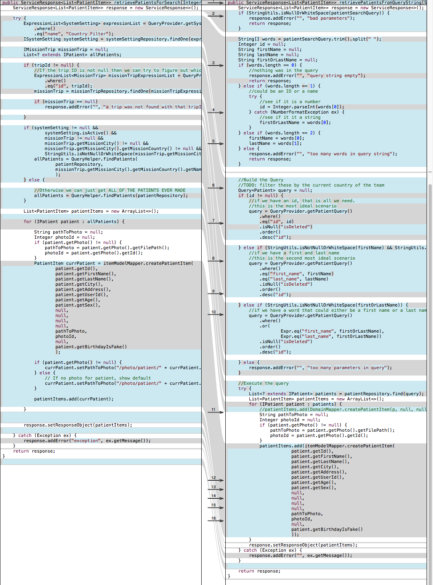

## Cohesion

There is only one cohesion metric, LCOM5, shown in the report.

LCOM5 metric indicates the number of functionalities of the class. It is calculated by taking a non-directed graph, where the nodes are the implemented local methods of the class and there is an edge between the two nodes if and only if a common (local or inherited) attribute or abstract method is used or a method invokes another. The value of the metric is the number of connected components in the graph not counting those, which contain only constructors, destructors, getters, or setters.

Thus, class with the high value of LCOM5 metric would have low cohesion and vice versa.

### Low Cohesion

According to the metric and our analysis, we got the two class with lowest cohesion (highest value of LCOM5 meanwhile) are:

#### `ItemModelMapper.java` (LCOM5: 16)

This class doesn’t have any attribute, and has 18 methods. Among the 18 methods, there are only two pairs of methods have invocation relationship. So the LCOM5 value of this class is calculated as 16 [`18 + (1 - 2) + (1 - 2)`].

This class's cohesion is __logical cohesion__. This class performs a series of creation actions. While all creation methods create different type of object. They only map the parameters values onto the new-created object.

#### `StringUtils.java` (LCOM5: 9)

This class doesn’t have any attribute, and has 12 methods. Among the 12 methods, there is one method invoked by another three methods. The rest of methods don't have relationship to each other. So the LCOM5 value of this class is calculated as 9 [`12 + (1 - 4)`].

This class's cohesion is __coincidental cohesion__. Although methods of this class are all about Strings, they are unrelated. Some methods format other type to String, while some methods just combine several Strings with a format, and some methods validate the input String and return Bool value.

### High Cohesion

By same rationale, we started searching for the highest cohesion by ascending order of these classes’ LCOM5 value. And then we noticed that there are many classes whose LCOM5 is 0 because they have only setter, getters, etc. So we skipped them as well as other trivial classes who have only one method inside.

Also, we skipped some exceptions during the mountain climb. For example, we skipped TriageController.java since we noticed that there are two records (TriageController and TriageControlle$1) pointing to the same class TriageController.java while these two records are having different stats on it. Another case is the AllowedRolesAction.java class. The LCOM5 given is 1 while we got 2 after the analysis thus we skipped it.
After the filter, we got the highest two: `TabController.java` and `UsersController.java`.

#### `TabController.java` (LCOM5: 1)

This class has 4 attributes, and 4 methods. All the 4 methods share the attribute `tabService`, which means LCOM5 value of this class is 1.

This class's cohesion is __information cohesion__. This class performs four actions, each of which has its own entry point and independent code. While all actions shared `sessionService` and `tabService`. The two shared attributes are shared data. Essentially, this is an abstract data type.

#### `UsersController.java` (LCOM5: 1)

This class has 6 attributes, and 7 methods. All the 7 methods are connected because they share the attributes.

The class's cohesion is __information cohesion__. This class performs six actions, each of which has its own entry point and independent code. While all actions are related to users' information, they share `missionTripService` .`sessionService`, `userService` and `roleService`.

### DIFF

In the case of our analysis, high-cohesion classes have attributes. And actions in the class share attributes. Attributes are shared data. While low-cohesion classes don't have attributes, their actions are neither sharing data, nor invoking each other a lot. Because those low-cohesion classes' actions are either functional unrelated or not associated.

## Bad Smell

### Internal Duplicate

#### `ResearchService.java`

This class is flagged with internal duplicate smell because these 3 methods have duplication code with each other:

- `buildVitalResultSet(List encounters, ResearchFilterItem filters): ResearchResultSetItem`
- `buildHeightResultSet(List encounters, ResearchFilterItem filters): ResearchResultSetItem`
- `buildAgeResultSet(List encounters, ResearchFilterItem filters): ResearchResultSetItem`

For example, the following picture picts the diff between the first and second method. According to which we can see there are several snippets of code are duplicated.

I agree that this detected smell is an actual smell. The duplicated code can be merged to another methods and place calls for the new method in both places. Merging duplicate code simplifies the structure of your code and makes it shorter.

#### `SearchService.java`

This class is flagged with internal duplicate smell because these 2 methods have duplication code with each other:

- `retrievePatientsForSearch(Integer tripId): ServiceResponse`
- `retrievePatientsFromQueryString(String patientSearchQuery): ServiceResponse`

The following picture picts the diff between the two methods. There are 6 lines of code is duplicated in both files.

About the question whether this smell is an actual smell, our opinion is neutral. Duplication of 6 lines of code is objective. But it's so minor that not merging them is also acceptable. Since merging duplicate code doesn't hurts anything, we can also say it's an actual smell.
